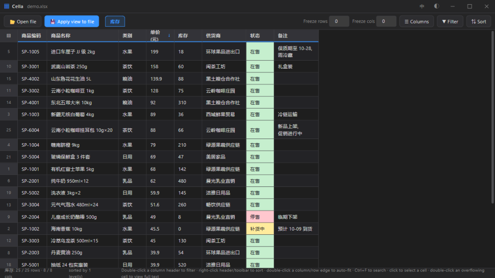
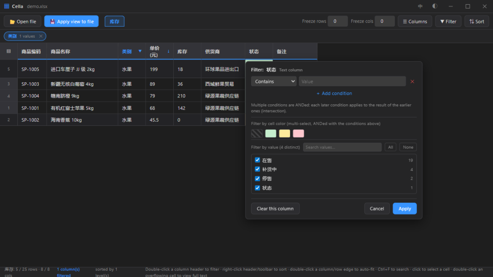
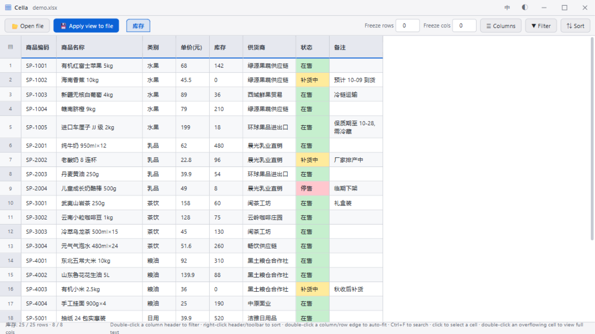

**English** | [简体中文](README.md)

# Cella

A tidy, fast desktop viewer for Excel spreadsheets — open a workbook, browse with frozen panes, filters and sorting, then optionally write the adjusted view back into the original file.

The name comes from Latin *cella* ("small room") — the etymon of the spreadsheet *cell*.



## Features

- **Opens** `.xlsx` / `.xlsm` (openpyxl) and legacy `.xls` (xlrd, including cell fill colors)
- **Frozen panes** — freeze any number of leading rows/columns; mark any row as a pinned header row
- **Reorder & hide columns** by dragging headers or from the column panel; drag rows to reorder
- **Filtering** — per-column condition filter (text/number operators), filter by cell color, cross-column multi-condition dialog, active-filter chips
- **Sorting** — multi-level sort with header indicators; materializes into row order when written back
- **Selection & copy** — click, range select, Ctrl/Shift multi-select, row/column select; `Ctrl+C` copies as a TSV matrix
- **Search** (`Ctrl+F`) across sheet / whole file / selection
- **Multi-file & multi-sheet** — tabs for open files, sheet tabs, per-sheet view state
- **View write-back** — column order, hidden columns, freeze panes, AutoFilter, column widths, wrap and row order are written back into the original workbook (with a `.bak` backup first for `.xlsx`)
- **Dark / light themes**, **Chinese / English UI** with one-click switching (defaults to the system language; instant toggle from the title bar), virtualized rendering for large sheets
- Native window resizing and dragging, DPI-friendly, centers on the current monitor



## Download & Run

Grab `Cella.exe` from the [Releases](https://github.com/Uky-Otonashi/Cella/releases) page (Windows, single file, no installation).

- Windows 10/11: works out of the box (uses the built-in WebView2 runtime).
- Windows 7 SP1 x64: requires .NET Framework 4.7.2+ and WebView2 Runtime Evergreen 109.

## Usage

1. Double-click `Cella.exe`, open a workbook.
2. Browse freely: freeze rows/columns, drag column headers to reorder, right-click headers for filters.
3. Double-click a header to open the filter panel (conditions + cell colors + value picks); combine filters across columns with the toolbar **Filter** dialog; sort from the toolbar or header context menu.
4. Optional: press **Apply view to file** to persist the current view into the workbook.
   - `.xlsx` / `.xlsm`: the original file is backed up as `<name>.xlsx.bak`, then overwritten.
   - `.xls`: read-only; the view is saved into a new `.xlsx` beside it.
5. `--selftest` command-line flag runs an internal bridge/window self-check (logs are written next to the exe).



## Project Structure

```
├── src/
│   ├── main.py        # Entry point: pywebview (WebView2) shell, js_api bridge
│   │                  # (file dialog, window controls, view write-back),
│   │                  # startup centering, and the --dev browser server
│   ├── xlio.py        # Workbook engine: reads xls/xlsx (values + colors),
│   │                  # and writes the adjusted view back to the file
│   ├── Cella.spec     # PyInstaller build spec (single-file exe)
│   └── ui/            # Frontend — plain HTML/CSS/JS, no framework
│       ├── index.html # App shell: title bar, toolbar, grid, welcome page
│       ├── app.js     # Virtual-scrolling grid, freeze panes, selection,
│       │              # filtering, sorting, search, multi-file/sheet tabs
│       ├── lang.js    # UI text i18n (zh/en dictionaries + switching)
│       └── app.css    # Themes (dark/light) and all styling
├── res/
│   └── app.ico        # Application icon
├── assets/            # Screenshots used by this README
└── dist/              # Local build output (not tracked in git; binaries ship via Releases)
```

## Notes & Limitations

- The viewer targets plain data sheets. Merged cells, charts, conditional formatting and comments are not re-ordered when columns/rows are written back.
- Excel's native color filter supports a single color; when multiple colors are active, only the first is written back (in-app filtering is unaffected).
- `.xls` is read-only; views are saved as a new `.xlsx`.
- Row heights are estimated then measured after render; pathological fonts may need a manual row height.

## Build from Source

Requires Python 3.8+ with `openpyxl`, `xlrd==1.2.0`, `pywebview`, `pyinstaller`.

```bash
# Desktop window
python src/main.py

# Browser dev mode (mock data server at http://127.0.0.1:8765)
python src/main.py --dev

# Build the single-file exe (run from the repo root; output in dist/)
python -m PyInstaller src/Cella.spec --noconfirm
```

## License

[MIT](LICENSE)
