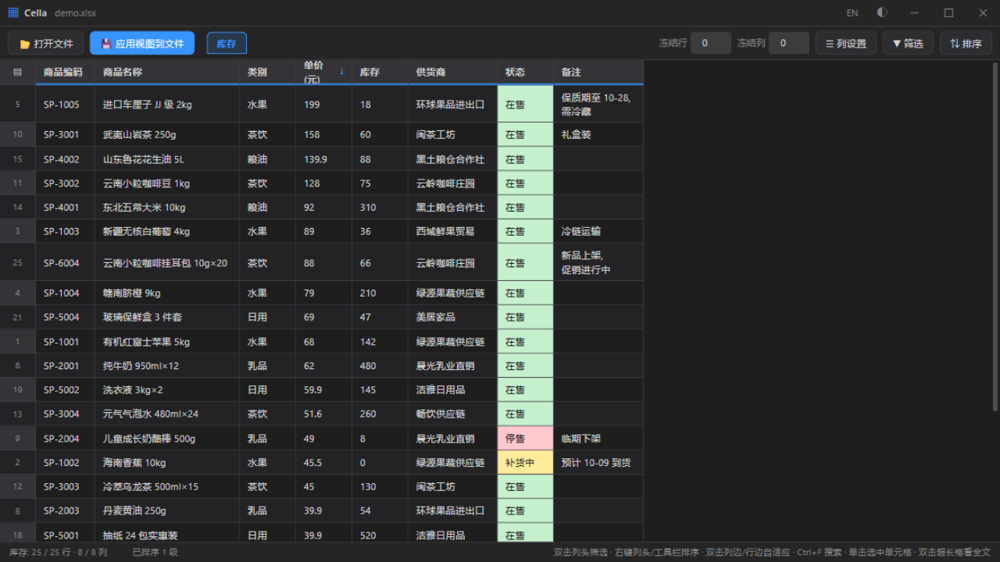
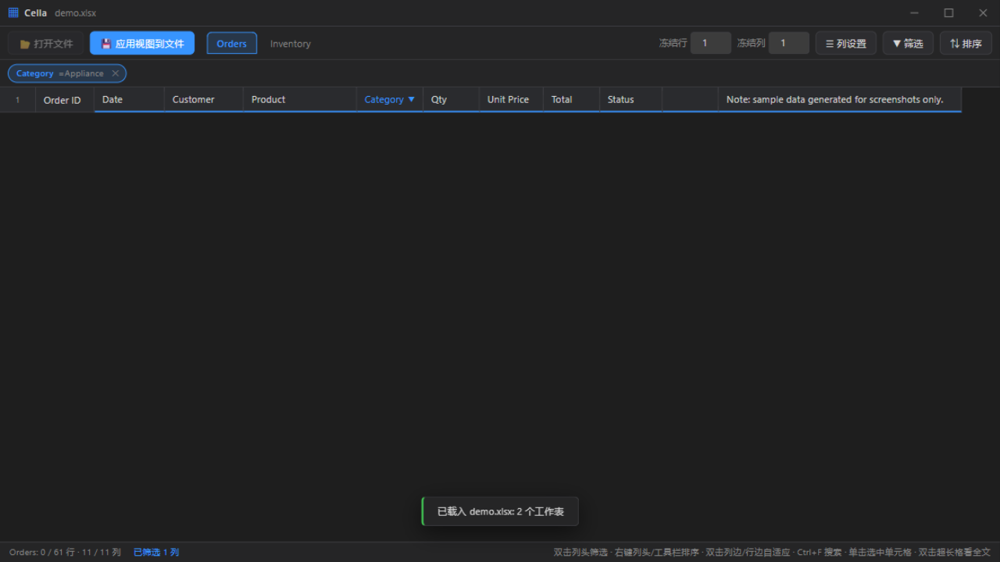
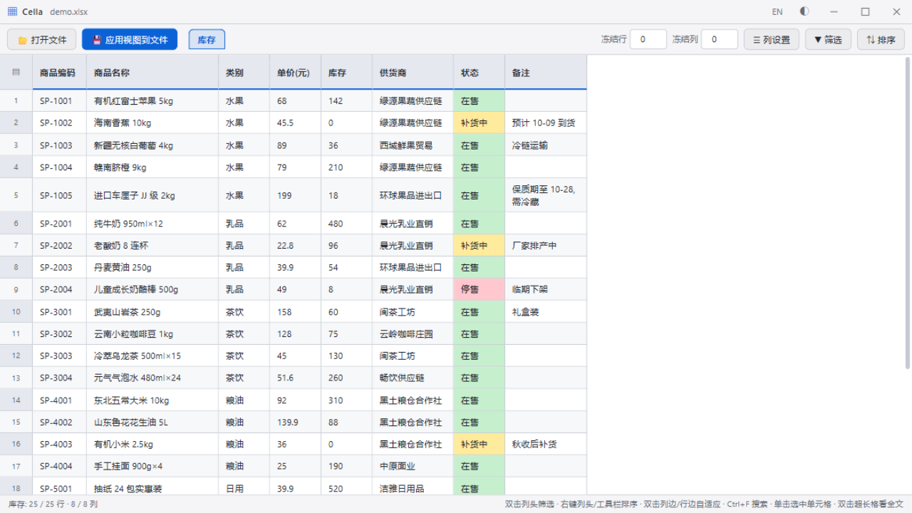

**简体中文** | [English](README.en.md)

# Cella

一个干净、快速的 Excel 表格桌面查看器——打开工作簿，用冻结窗格、筛选、排序自由浏览，还可以把调整好的视图写回原文件。

名字来自拉丁语 *cella*（"小室"），正是表格 *cell*（单元格）一词的词源。



## 功能特性

- **打开** `.xlsx` / `.xlsm`（openpyxl）与旧版 `.xls`（xlrd，支持读取单元格填充色）
- **冻结窗格**——任意冻结前 N 行/列；任意行可设为置顶标题行
- **列重排与隐藏**——拖拽列头或从列面板操作；行也可拖拽重排
- **筛选**——按列条件筛选（文本/数值运算符）、按单元格颜色筛选、跨列多条件组合对话框、生效筛选标签卡
- **排序**——多级排序带表头指示；写回时物化为行顺序
- **选择与复制**——单击、框选、Ctrl/Shift 多选、整行/整列选择；`Ctrl+C` 按 TSV 矩阵复制
- **搜索**（`Ctrl+F`）——当前 sheet / 整个文件 / 选区范围
- **多文件多 sheet**——文件标签页、sheet 标签页，各 sheet 独立视图状态
- **视图写回**——列顺序、隐藏列、冻结窗格、AutoFilter、列宽、换行、行顺序写回原工作簿（`.xlsx` 写回前先做 `.bak` 备份）
- **暗色/浅色主题**，大表虚拟滚动渲染
- 窗口原生拖拽与八方向调整尺寸，DPI 友好，启动居中于当前显示器



## 下载与运行

从 [Releases](https://github.com/Uky-Otonashi/Cella/releases) 页面下载 `Cella.exe`（Windows 单文件，免安装）。

- Windows 10/11：开箱即用（使用系统自带 WebView2 运行时）。
- Windows 7 SP1 x64：需 .NET Framework 4.7.2+ 与 WebView2 Runtime Evergreen 109。

## 使用方法

1. 双击 `Cella.exe`，打开一个工作簿。
2. 自由浏览：冻结行/列、拖拽列头重排、右键列头筛选。
3. 双击列头打开筛选面板（条件 + 单元格颜色 + 按值挑选）；工具栏 **筛选** 对话框可跨列组合多条件；从工具栏或列头右键菜单排序。
4. 可选：点 **应用视图到文件**，把当前视图持久化进工作簿。
   - `.xlsx` / `.xlsm`：原文件先备份为 `<名称>.xlsx.bak`，然后原地覆盖。
   - `.xls`：只读；视图保存为旁边的新 `.xlsx` 文件。
5. 命令行 `--selftest` 参数运行内部桥/窗口自检（日志写在 exe 同目录）。



## 项目结构

```
├── src/
│   ├── main.py        # 入口：pywebview（WebView2）外壳、js_api 桥
│   │                  # （文件对话框/窗口控制/视图写回）、
│   │                  # 启动居中、--dev 调试服务器
│   ├── xlio.py        # 工作簿引擎：读取 xls/xlsx（值+颜色），
│   │                  # 并把调整后的视图写回文件
│   ├── Cella.spec     # PyInstaller 打包配置（单文件 exe）
│   └── ui/            # 前端——原生 HTML/CSS/JS，无框架
│       ├── index.html # 应用骨架：标题栏/工具栏/表格/欢迎页
│       ├── app.js     # 虚拟滚动表格、冻结、选择、筛选、
│       │              # 排序、搜索、多文件/多 sheet 标签
│       └── app.css    # 主题（暗/浅）与全部样式
├── res/
│   └── app.ico        # 应用图标
├── assets/            # README 截图
└── dist/              # 本地构建产物（不进 git；成品通过 Releases 分发）
```

## 注意事项与限制

- 面向普通数据表。合并单元格、图表、条件格式、批注在列/行写回时**不会**跟着重排。
- Excel 原生颜色筛选只支持单色；多色筛选生效时写回只写第一种颜色（应用内筛选不受影响）。
- `.xls` 只读；视图保存为新的 `.xlsx`。
- 行高先估算后实测修正；极端字体下可能需要手动调行高。

## 从源码构建

需要 Python 3.8+，装有 `openpyxl`、`xlrd==1.2.0`、`pywebview`、`pyinstaller`。

```bash
# 桌面窗口
python src/main.py

# 浏览器调试模式（mock 数据服务器 http://127.0.0.1:8765）
python src/main.py --dev

# 构建单文件 exe（产物在 src/dist/）
python -m PyInstaller src/Cella.spec --noconfirm
```

## 许可证

[MIT](LICENSE)
